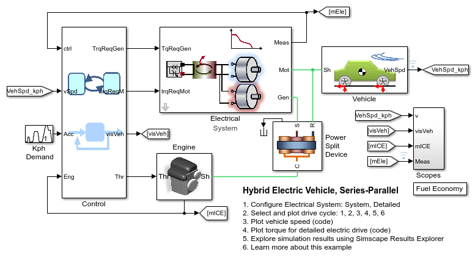
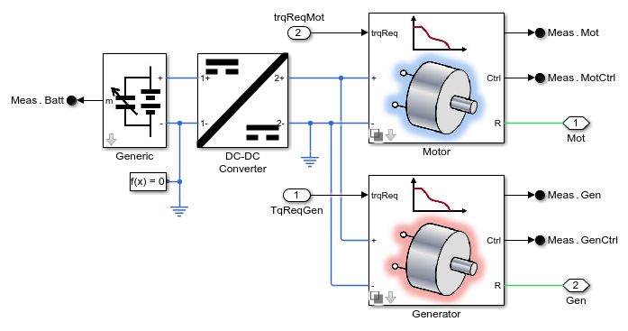
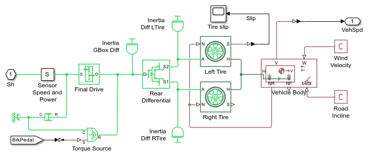
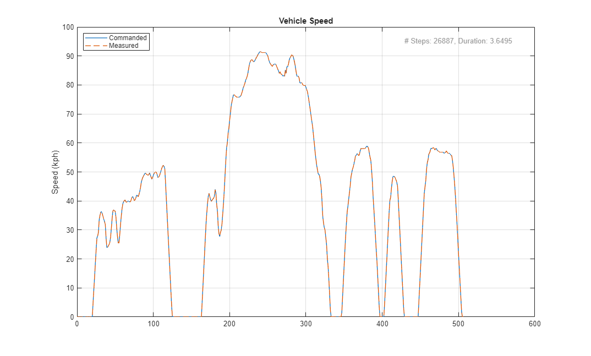
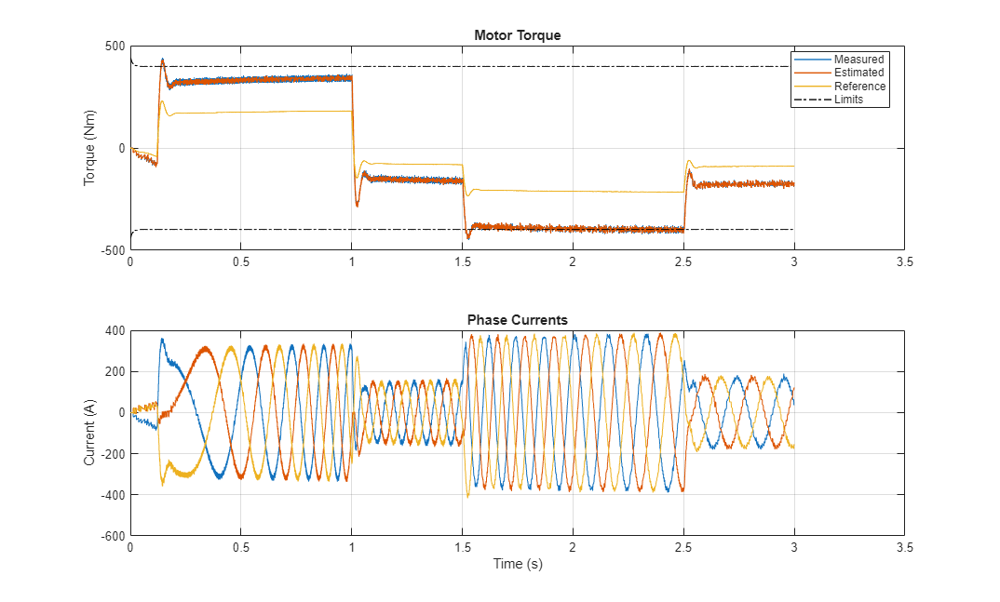

# HEV Powersplit Adapted

This folder is a cleaned distribution of the adapted power-split hybrid electric vehicle model. The main entry point was renamed from `HEV_SeriesParallel.slx` to `HEV_powersplit_adapted.slx` to make the model identity more explicit.

The clean copy keeps the files needed to open, simulate, document, and extend the model, while removing generated caches, temporary variants, and draft notes from the working folder.

## Main Entry Points

- Model: `HEV_powersplit_adapted.slx`
- Startup script: `Scripts_Data/startup_HEV_Model.m`
- Demo page: `Scripts_Data/HEV_Model_Demo_Script.html`
- Overview script: `Overview/HEV_powersplit_adapted_overview.m`
- Parameter sweep workflow: `Workflows/Param_Sweep/HEV_Model_PCT_Sim.m`

## Quick Start

1. Open MATLAB in this folder.
2. Run `Scripts_Data/startup_HEV_Model.m` for the demo workflow, or open `HEV_powersplit_adapted.slx` directly.
3. Use the scripts under `Scripts_Data` and `Workflows` for plots, parameter sweeps, and fuel-consumption studies.

## Model Snapshots

### Overview

### Electrical System

### Vehicle

### System-Level Results

### Detailed Results

## Notes

- Support scripts still keep some original helper filenames for compatibility with the existing model internals.
- Generated artifacts such as `slprj/`, `*.slxc`, and temporary parallel-sweep model copies are intentionally excluded and can be regenerated by MATLAB/Simulink as needed.
- Local editor metadata is not part of the distributable model folder.
- `LICENSE.md` and `SECURITY.md` were preserved from the original package.

## License

See `LICENSE.md`.
